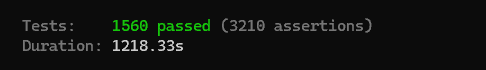

# Certify LMS

マルチ資格対応の資格学習プラットフォームです。受講生は資格ごとの教材で学習し、演習問題・模擬試験で理解度を確かめながら、コーチの面談サポートを受けて資格取得を目指せます。

> プロジェクト構造・ドメインモデル・コードの読み進め方は [ONBOARDING.md](./ONBOARDING.md) を参照してください。

## 主な機能

| ロール | 機能 |
|---|---|
| 受講生（student） | 教材閲覧 / 演習問題・苦手分野ドリル / 模擬試験（分野別ヒートマップ・合格可能性スコア）/ 面談予約 / チャット / 学習時間・進捗・ストリーク管理 / 修了証の受領 |
| コーチ（coach） | 教材・演習問題・模試の管理 / 担当受講生の進捗フォロー / 面談対応・面談メモ / チャット |
| 管理者（admin） | ユーザー招待・管理 / 資格・資格分類マスタ管理 / 資格へのコーチ割当 / 面談回数の付与 / 全体ダッシュボード |

## 動作環境

- Docker Desktop / Docker Compose
- 開発環境は Laravel Sail で構築します（PHP コンテナ・MySQL・Mailpit・phpMyAdmin を起動）

## 環境構築手順

### 1. リポジトリの clone

```bash
git clone <このリポジトリの URL>
cd <リポジトリ名>
```

### 2. 環境変数ファイルの作成

```bash
cp .env.example .env
```

`.env.example` は Sail 向けに設定済みのため、コピーするだけでローカル開発を始められます（外部サービス連携のキーは後述）。

### 3. 依存パッケージのインストール（初回のみ）

`vendor/` がまだ無いため、初回のみ Docker 経由で Composer を実行します。

```bash
docker run --rm \
    -u "$(id -u):$(id -g)" \
    -v "$(pwd):/var/www/html" \
    -w /var/www/html \
    laravelsail/php84-composer:latest \
    composer install --ignore-platform-reqs
```

### 4. Sail エイリアスの設定（推奨）

```bash
alias sail='./vendor/bin/sail'
```

以降のコマンドはこのエイリアス前提で記載します（未設定の場合は `./vendor/bin/sail` に読み替えてください）。

### 5. コンテナの起動

```bash
sail up -d
```

### 6. アプリケーションの初期化

```bash
sail artisan key:generate
sail artisan storage:link
sail artisan migrate:fresh --seed
```

`storage:link` は教材画像・プロフィール画像の配信に必要です。`migrate:fresh --seed` でテーブル作成とデモデータ投入が行われます（いつでも再実行してデータを初期状態に戻せます）。

### 7. フロントエンドのビルド

```bash
sail npm install
sail npm run build
```

Blade / CSS / JS を編集しながら開発する場合は、`build` の代わりに `sail npm run dev` を起動したままにしてください（Vite のホットリロードが効きます）。

### 8. 動作確認

http://localhost:8000 にアクセスし、下記の[ログインアカウント](#ログインアカウント)でログインできればセットアップ完了です。

## 開発環境 URL

| 用途 | URL |
|---|---|
| アプリケーション | http://localhost:8000 |
| phpMyAdmin（DB 確認） | http://localhost:8080 |
| Mailpit（メール確認） | http://localhost:8025 |

アプリケーションが送信するメール（招待メールなど）はすべて Mailpit に届きます。実際のメールは送信されません。

## ログインアカウント

`migrate:fresh --seed` 後、以下の固定アカウントが使えます（パスワードはすべて `password`）。

| ロール | メールアドレス | 備考 |
|---|---|---|
| 管理者 | admin@certify-lms.test | 全機能にアクセス可能 |
| コーチ | coach@certify-lms.test | IT 系資格の担当 |
| コーチ | coach2@certify-lms.test | ビジネス系資格の担当 |
| 受講生 | student@certify-lms.test | 受講中の資格・学習履歴・面談などのデモデータ付き |
| 修了生 | student-graduated@certify-lms.test | 修了生。チケットS-B-06の動作確認の際に使われる|
| 修了生2 | student-graduated2@certify-lms.test | 同上 |

このほか、ライフサイクル（招待中 / 受講中 / 卒業 / 退会）を網羅したデモユーザーが投入されます。

> 本サービスは**招待制**です。公開の会員登録画面はありません。新規ユーザーを作るには、管理者でログイン → ユーザー管理から招待 → Mailpit で招待メールの URL を開く → オンボーディング登録、という流れになります。

## テスト

```bash
sail artisan test                  # 全テスト実行
sail artisan test --filter=Xxx    # クラス名・メソッド名で絞り込み
```

※テスト実行結果


## コード整形

Laravel Pint を使用しています。コミット前に実行してください。

```bash
sail bin pint --dirty    # 変更ファイルのみ整形
sail bin pint --test     # 整形漏れの確認（CI 相当のチェック）
```

## 画像取得

```bash
sail artisan storage:link
```

## 使用技術

- PHP 8.5 / Laravel 10
- MySQL 8.4
- Laravel Fortify（認証）/ Laravel Sanctum（API 認証）
- Blade + Tailwind CSS + Vite（JavaScript は素の JS、フレームワーク不使用）
- PHPUnit / Laravel Pint
- league/commonmark（教材本文の Markdown レンダリング）
- Pusher（チャットのリアルタイム配信）
- Docker（Laravel Sail）
- google/apiclient": "^2.19
- Guzzle HTTP Client

## 環境変数

`.env.example` をコピーするだけで、すべての機能がローカルで動作します（メールは Mailpit に配信されます）。

- `PUSHER_*` — チャットのリアルタイム配信に使用します。有効にする場合は Pusher のキーを取得して設定し、`BROADCAST_DRIVER=pusher` に変更してください。未設定（既定の `BROADCAST_DRIVER=log`）でもメッセージの送受信自体は動作し、相手画面へのリアルタイム反映のみ行われません

新しい環境変数やセットアップ手順を追加した場合は、`.env.example` と本 README に追記し、チームの誰でも環境を再現できる状態を保ってください。

※docs以下にそれぞれチケット番号のファイルがあり、中に詳細設計を記載しているので、そちらを参照してください。

-------------------------------------------------------
以下実装機能の説明を記載します。

1. 通知機能
　1.1. 通知チャネル
　1.2. お知らせ配信
　1.3. 面談リマインダー通知
2. 通知の非同期処理
3. Googleカレンダー
4. AIChat(Gemini)
5. 修了書ダウンロード
6. 面談パックの追加購入
7. 外部API関連テスト

## 1. 通知機能

### 通知チャネル

以下の通知は、アプリ内通知とメールの両方で配信されます。

- お知らせ配信
- 面談リマインダー通知(面談前日,面談1時間前)

### お知らせ配信

管理者がお知らせを配信すると、対象ユーザーに以下の通知が送信されます。

- アプリ内通知
- メール

対象ユーザー

- 全受講生
- 特定の受講生
- コーチ
- 対象者以外には届かない

#### お知らせ配信の動作確認手順

1. 以下のコマンドでLaravelを起動させる

```bash
./vendor/bin/sail up -d
```

2. 管理者アカウントでログイン
3. 左側の「お知らせ配信」を開く
4. お知らせを新規作成する
5. 配信対象を選択する
6. お知らせを配信する
7. 対象ユーザーでログイン
8. 通知ベル、または通知を開く
9. 以下を確認する

- 通知が表示されている
- お知らせタイトルが表示される
- お知らせ内容が表示される

10. Mailpitを開く
11. 対象ユーザー宛てのメールが届いていることを確認する
12. 対象外ユーザーでログイン
13. 通知ベル、または通知を開く
14. 該当のお知らせが表示されていないことを確認する
15. Mailpitでも対象外ユーザー宛てのメールが送信されていないことを確認する

### 面談リマインダー通知

予約済みの面談に対して、以下のタイミングで通知を送信します。

- 面談前日
- 面談1時間前

キャンセル済みの面談には通知を送信しません。

また、同一の面談・同一のタイミングのリマインダー通知は、複数回送信されません。

### 手動実行

手動実行の際に必要な環境は以下のとおりである
- sail
- Queue Worker
- Mailpit(メールの送信結果を確認する場合)

そのため、以下のコマンドを実行し起動したままにしておいてください。

```bash
./vendor/bin/sail up -d
```

```bash
./vendor/bin/sail artisan queue:work
```

以下の通知はメールにも届く仕様となっている
- お知らせ配信（配信直後）
- 面談前日リマインダー
- 面談1時間前リマインダー

事前に以下のテストデータを用意します
- 面談前日通知の対象となる予約済み面談
- 1時間前通知の対象となる予約済み面談
- キャンセル済みの面談

その上で以下のコマンドをそれぞれ実行する

前日通知：

```bash
./vendor/bin/sail artisan notifications:send-meeting-reminders --window=eve
```

一時間前通知：

```bash
./vendor/bin/sail artisan notifications:send-meeting-reminders --window=one_hour_before
```

以下の事項を確認する

- 対象の受講生にアプリ内通知が届く
- 対象の受講生にメールが届く
- キャンセル済み面談には通知されない
- 同じコマンドを再実行しても同じ通知が重複して送信されない

### 自動実行
Laravelのschedulerで自動実行されます

cronで1分ごとに実行してください

* * * * * cd /path/to/Certify-LMS && ./vendor/bin/sail artisan schedule:run >> /dev/null 2>&1


※開発環境でschedulerを常時起動させるためには以下のコマンドを入力し、常時起動させたままにしておいてください。

この時、queue:workも起動させておく必要があります。

cron方式（本番環境）では常時起動させておく必要はありません。
ローカル開発環境で動作確認を行う場合は、設定が簡単な schedule:work の使用を推奨します。

```bash
./vendor/bin/sail artisan schedule:work
```

```bash
./vendor/bin/sail artisan queue:work
```

つまり、

手動実行時：Queue Worker のみ

自動実行時（ローカル環境）：schedule:work + Queue Worker

自動実行時（本番環境）：cron + schedule:run + Queue Worker

の構成となります。

また、
ローカル開発環境：schedule:work

本番環境：cron + schedule:run

のように使い分けて動作確認を行ってください

| 環境 | ローカル | 本番/cron |
| 手動 |  Queue Worker | Queue Worker |
| 自動 | Queue Worker + schedule:work | cron + schedule:run + Queue Worker|

###　メールの確認
環境開発ではMailpitを使用してメールを確認する

1.sailを起動する

```bash
./vendor/bin/sail up -d
```

2．ブラウザで以下にアクセスする

http://localhost:8025

3．メール確認

Mailpitを開き、対象ユーザーへのメールが届いていること、以下の事項をを確認します。

- メールが届いている
- メールの件名がお知らせのタイトルになっている
- メール本文にお知らせの内容が表示されている

4. 面談リマインダーメールを確認

以下のコマンドを実行してリマインダー通知を発火させます。

前日通知：

./vendor/bin/sail artisan notifications:send-meeting-reminders --window=eve

1時間前通知：

./vendor/bin/sail artisan notifications:send-meeting-reminders --window=one_hour_before

Mailpitを開き、対象の受講生にメールが届いていることを確認します

※注意事項※

- Mailpitは開発環境用のメール確認ツールです。
- 実際のメールアドレスにはメールを送信せず、Mailpit上で送信内容を確認します。

### 通知ベル

受講生・コーチ向けの通知機能を実装しています。

TopBarの通知ベルから通知を確認でき、未読通知の確認・既読化・全件既読化ができます。

管理者には通知ベル・通知ポップオーバーを表示しません。

### API

| Method | URL                                         | 内容                |
| ------ | ------------------------------------------- | ----------------- |
| GET    | `/api/v1/notifications`                     | 認証ユーザーの通知一覧を取得    |
| POST   | `/api/v1/notifications/{notification}/read` | 指定した通知を既読化        |
| POST   | `/api/v1/notifications/read-all`            | 認証ユーザーの未読通知を全件既読化 |

APIは `auth:sanctum` により認証ユーザーのみアクセス可能です。

### APIのアクセス制御

通知APIでは、認証ユーザー本人の通知のみを操作できます。

他ユーザーの通知IDを指定して既読化しようとした場合も、本人の通知として扱われないよう制御しています。

実際のメールアドレスにはメールを送信せず、Mailpit上で送信内容を確認します。

### APIの動作確認
APIはSanctum認証が必要です。
ブラウザでログインをしてから動作確認を行ってください。

1. 認証済みユーザーで通知一覧APIを実行します

```http
GET /api/v1/notifications
```
※レスポンスに記載されているIDが通知IDです。

2. 自分の通知IDを指定して既読化する

```http
POST /api/v1/notifications/{notification}/read
```

※read_atが設定されていることを確認します。

3. 通知が既読になったことを確認する
4. 全て既読APIを実行する

```http
POST /api/v1/notifications/read-all
```

5. 自分の未読通知がすべて既読になっていることを確認する
6. 未認証状態でAPIへアクセスし、認証エラーになることを確認する
7. 別ユーザーの通知IDを指定して既読化しようとし、他ユーザーの通知を操作できないことを確認する

### 通知ベルの確認

受講生・コーチでログインすると、画面上部の通知ベルから通知を確認できます。

1. student@certify-lms.test または coach@certify-lms.test でログインする
2. TopBarの通知ベルをクリックする
3. 通知ポップオーバーが表示される
4. 通知一覧が表示される
5. 「すべて」「未読」のタブを切り替えて確認する
6. 未読通知をクリックして既読化する
7. 「すべて既読」で未読通知を一括で既読化する

未読通知がある場合は、通知ベルに未読件数が表示されます。

管理者（admin@certify-lms.test）には通知ベル・通知ポップオーバーを表示しません。

## 2. 通知の非同期処理

通知・メール送信にはLaravel Queueを使用しています。

.env に以下を設定します。

```env
QUEUE_CONNECTION=database
```

Queue Workerを起動し、起動したままにしておいてください。

```bash
./vendor/bin/sail artisan queue:work
```

通知が発生する操作を行うと、通知・メールの処理はQueueに投入され、Workerによってバックグラウンドで実行されます。

### Queueを使用した通知の確認

1. Queue Workerを起動する

```bash
./vendor/bin/sail artisan queue:work
```

2. 別ターミナルでアプリケーションにログインする
3. お知らせ配信、面談予約、チャット、質問掲示板への回答など、通知が発生する操作を行う
4. Queue Worker側でジョブが処理されることを確認する
5. 通知ベルまたはMailpitで通知結果を確認する
6. 通知ジョブのリトライ

通知ジョブは一時的なエラーに備えて最大3回まで再試行します。

public int $tries = 3;

public array $backoff = [10, 30, 60];

再試行間隔は10秒、30秒、60秒です。

最大試行回数を超えて失敗したジョブは failed_jobs テーブルに記録されます。

失敗ジョブの確認：

```bash
./vendor/bin/sail artisan queue:failed
```

失敗ジョブを再実行：

```bash
./vendor/bin/sail artisan queue:retry <failed-job-id>
```

すべての失敗ジョブを再実行：

```bash
./vendor/bin/sail artisan queue:retry all
```

他ユーザーの通知IDを指定して既読化しようとしても、その通知を本人の通知として操作することはできません。

## 3. Google Calendar API の設定

Google Calendar連携を使用する場合は、以下の環境設定が必要です。

### Google Calendar API パッケージ

Google Calendar APIとの連携には `google/apiclient` を使用しています。

`composer.json` に以下のパッケージが登録されています。

```json
"google/apiclient": "^2.19"
```

### Google Calendar API の有効化

Google Cloud Consoleで「Google Calendar API」を有効化してください。

### OAuth 2.0 Client ID の設定

Google Cloud ConsoleでOAuth 2.0 Client IDを作成します。

作成したClient IDとClient Secretを .env に設定してください。

```env
GOOGLE_CLIENT_ID=xxxxxxxx
GOOGLE_CLIENT_SECRET=xxxxxxxx
```

### Google Cloud ConsoleのOAuth設定では、以下のリダイレクトURIを登録してください。

```bash
http://localhost:8000/settings/google-calendar/callback
```
つまり、.envはこうなります

```env
GOOGLE_CLIENT_ID=xxxxxxxx
GOOGLE_CLIENT_SECRET=xxxxxxxx
GOOGLE_REDIRECT_URI=http://localhost:8000/settings/google-calendar/callback
```

.env を設定したあと、設定をクリアします。

```bash
./vendor/bin/sail artisan config:clear
```

### Google Calendarを連携する

アプリケーションにログインし、Google Calendar連携画面からGoogleアカウントとのOAuth認証を行います。

### Google Calendar連携の確認

### 1. 初期データ

Seeder実行後、

- coach@certify-lms.test：Google Calendar連携済み
- coach2@certify-lms.test：Google Calendar未連携

となります。

※実際のGoogle Calendar連携を確認する場合

Seederで作成されたGoogle CalendarTokenはダミー値です。
実際のGoogle Calendar APIとの通信確認を行う場合は設定画面から一度Google Calendar連携を解除し、再度GoogleアカウントとのOAuth認証を行ってください。

### 動作確認

1. coach@certify-lms.test でログインする
2. 左側の「面談設定」を開く
3. 既存のGoogle Calendar連携を解除する
4. 再度「Google Calendarと連携」を実行する
5. GoogleアカウントのOAuth認証を行う
6. 連携が完了することを確認する
7. Google Calendarに予定を入れる
8. 同日の同時刻に面談可能枠を設ける
9. Googleカレンダーに予定がない日にち、時刻にも面談可能枠を設ける
10. 受講生としてログインし、面談予約画面を表示する
11. Googleカレンダーに予定を入れてある日にちの時刻は、面談可能日（時間）として表示されないことを確認する。
12. Googleカレンダーに予定の入っていない日にち（時間）は表示されていることを確認する
13. 受講生が面談の予約を入れる
14. コーチのGoogle Calendar側に予定が反映されることを確認する
15. 面談をキャンセルしたとき、Google calendarの面談予約も消えていることを確認する
16. 連携していないコーチはGoogle calendarに面談予約が反映されないこと、Google calendarの予定が面談可能枠に反映されないことを確認する 

## 4. AI相談機能

AI相談機能では Gemini API を利用しています。

AI相談機能を利用するには、Gemini API キーが必要です。

### Gemini API パッケージ

Gemini APIとの通信には、Guzzle HTTP Clientを使用しています。

### Gemini API キーを取得

Google AI Studio から Gemini API キーを取得してください。

取得したAPIキーを `.env` に設定します。

```env
GEMINI_API_KEY=取得したAPIキー
```

設定を反映させるために以下のコマンドを実行してください。

```bash
./vendor/bin/sail artisan config:clear
```

### Gemini API のモデル設定

使用するGeminiモデルは config/ai-chat.php で設定します。

return [
    'gemini' => [
        'model' => env('GEMINI_MODEL', 'gemini-3.6-flash'),
    ],
];

.env では必要に応じて使用するモデルを変更できます。

GEMINI_MODEL=gemini-3.6-flash

### データベース

AI相談機能では以下のテーブルを使用します。

- ai_chat_conversations
- messages

初回セットアップ時はマイグレーションを実行してください。

```bash
./vendor/bin/sail artisan migrate
```

conversations に会話情報を保存し、ai_chats に会話内のメッセージを保存します。

### AI相談機能の利用条件

AI相談機能を利用できるのは以下の条件を満たす受講生です。

受講生であること
学習中であること
会話のオーナー本人であること

また、作成した会話は会話のオーナー本人のみ閲覧・操作できます。

### Gemini API の利用制限

Gemini API の無料枠には利用上限があります。

上限に達した場合、AIからの回答を取得できません。

その場合は時間をおいて再度実行するか、Gemini API の利用状況・料金プランを確認してください。

### 動作確認

1. Laravel Sailを起動します。

```bash
./vendor/bin/sail up -d
```

2. 学習中の受講生アカウントでログインします。
3. AI相談画面を開きます。
4. メッセージを入力して送信します。
5. Gemini APIからの回答が表示されることを確認します。
6. フローティングウィジェットからもメッセージを送信し、AIから回答が返ることを確認します。
7. 作成した会話を再度開き、過去のメッセージが保持されていることを確認します。
8. 別の受講生アカウントから、他の受講生が作成した会話を閲覧・操作できないことを確認します。

## 5. 修了証ダウンロード機能の確認

修了証ダウンロード機能を確認するためのテストデータは、
`DownloadSeeder` で投入できます。

### ダウンロード確認用データを投入

以下を実行してください。

```bash
./vendor/bin/sail artisan db:seed --class=DownloadSeeder
```

Seederでは、以下の状態を作成します。

修了生一郎
基本情報技術者試験の公開済み資格を修了
コーチ1を担当コーチとして設定
修了証を発行
修了証PDFの実体を生成

修了生花子
日商簿記 2 級の公開済み資格を修了
コーチ2を担当コーチとして設定
修了証を発行
修了証PDFの実体を生成

Seederを複数回実行しても、既に発行済みの修了証を重複作成せず、
PDF実体が存在しない場合のみPDFを生成します。

### PDF実体の確認

修了証のPDFは、DB上の pdf_path だけではなく、
実際にStorageへ生成されます。

PDFの保存先：

storage/app/certificates/

Seeder実行後、以下のようなPDFファイルが生成されます。

storage/app/certificates/{ULID}.pdf

### PDFが生成されているか確認

Tinkerを起動します。

```bash
./vendor/bin/sail artisan tinker
```

以下を実行してください。

```bash
App\Models\Certificate::all()->map(fn ($certificate) => [
    'user' => $certificate->user->name,
    'pdf_path' => $certificate->pdf_path,
    'exists' => Storage::disk('local')->exists($certificate->pdf_path),
]);
```
exists が true になっていれば、PDFの実体が存在します。

期待する確認結果
|ユーザー|対象|結果|
|一郎|自分の修了証|ダウンロード可能|
|花子|自分の修了証|ダウンロード可能|
|コーチ1|一郎の修了証|ダウンロード可能|
|コーチ1|花子の修了証|アクセス不可|
|コーチ2|花子の修了証|ダウンロード可能|
|コーチ2|一郎の修了証|アクセス不可|
|管理者|一郎・花子の修了証|	ダウンロード可能|


## 6. 面談パック購入機能

以下の環境を準備する。

1. Composerパッケージのインストール

Stripe PHP SDKをComposerでインストールする。

```bash
composer require stripe/stripe-php
```

2. インストール後、依存関係を更新する。

```bash
composer dump-autoload
```

3. Laravel Sailを使用している場合は、コンテナ内で実行することもできる。

```bash
./vendor/bin/sail composer require stripe/stripe-php
```

### Stripe APIキーの設定

`.env` にStripeの秘密鍵を設定する。

```env
STRIPE_SECRET=sk_test_xxxxxxxxxxxxxxxxx

STRIPE_WEBHOOK_SECRET=whsec_xxxxxxxxxxxxxxxxx
```

`config/services.php` にStripeの設定を追加する。

```php
'stripe' => [
    'secret' => env('STRIPE_SECRET'),
    'webhook_secret' => env('STRIPE_WEBHOOK_SECRET'),
],
```

設定変更後はLaravelの設定キャッシュをクリアする。

```bash
./vendor/bin/sail artisan config:clear
```

### 面談パックの初期データ

`MeetingPackSeeder` で公開中の面談パックを登録する。

例：

* 1回パック

  * 面談回数：1回
  * 価格：3,000円
* 5回パック

  * 面談回数：5回
  * 価格：12,000円
* 10回パック

  * 面談回数：10回
  * 価格：21,000円

公開中の面談パックのみ購入画面に表示する。

```php
MeetingPack::query()
    ->where('status', 'published')
    ->orderBy('sort_order')
    ->get();
```

###  Paymentテーブル

面談パックの購入情報を `payments` テーブルに保存する。

主な保存項目：

* `meeting_pack_id`
* `user_id`
* `amount`
* `quantity`
* `status`
* `paid_at`
* `stripe_session_id`

`meeting_pack_id` によって、どの面談パックを購入したかを記録する。

### PaymentStatus

決済状態は `PaymentStatus` enum で管理する。

```php
enum PaymentStatus: string
{
    case Succeeded = 'succeeded';
    case Failed = 'failed';
}
```

決済成功の場合は `succeeded` とする。

決済失敗の場合は `failed` とする。

保留の場合は`Pending` とする。

### 面談回数の管理

面談回数は `MeetingQuotaTransaction` で履歴を管理する。

購入成功時には、以下のTransactionを作成する。

```php
MeetingQuotaTransaction::create([
    'user_id' => $userId,
    'type' => MeetingQuotaTransactionType::Purchased,
    'amount' => $meetingPack->meeting_count,
    'occurred_at' => now(),
    'related_payment_id' => $payment->id,
]);
```

決済成功時だけ `Purchased` を作成する。

決済失敗・キャンセルの場合は `Purchased` を作成しないため、残面談回数には反映されない。


### 残面談回数の集計

`MeetingQuotaService` で残面談回数を計算する。

```php
return $user->max_meetings + $sum;
```

`Consumed`、`Refunded`、`Purchased`、`AdminGrant` のTransactionを集計し、`max_meetings` と合算する。

`granted_initial` は `max_meetings` と二重計上になるため集計対象から除外する。

### Stripe Checkoutの作成

選択された `meeting_pack_id` を使って `MeetingPack` を取得する。

```php
$meetingPack = MeetingPack::query()
    ->where('id', $request->meeting_pack_id)
    ->where('status', 'published')
    ->firstOrFail();
```

Stripe Checkout Sessionを作成する。

このとき、購入者と面談パックをmetadataに保存する。

```php
'metadata' => [
    'user_id' => (string) auth()->id(),
    'meeting_pack_id' => (string) $meetingPack->id,
],
```

これにより、StripeからWebhookを受け取ったときに、

「誰が」

「どの面談パックを」

購入したのかを特定できる。

### Stripe決済画面

Checkout Sessionを作成したら、Stripeが発行したURLへリダイレクトする。

```php
return redirect()->away($session->url);
```

アプリ側でカード情報を直接処理せず、Stripe Checkoutを利用して決済する。

### 決済完了画面

決済成功後は以下のURLへ戻る。

```text
GET /meeting-quota/success
```

ルート名：

```text
meeting-quota.success
```

Stripe Checkout Session IDをQuery Parameterとして受け取る。

```text
?session_id={CHECKOUT_SESSION_ID}
```

完了画面からダッシュボードへ戻れる導線を用意する。

### 決済キャンセル

Stripe Checkoutでキャンセルした場合は、

```text
meeting-quota.checkout.select
```

へ戻す。

キャンセル時には、

* Paymentを成功扱いにしない
* `Purchased` Transactionを作成しない
* 残面談回数を加算しない

ようにする。

### Stripe Webhook

Stripeから決済結果を受け取る公開エンドポイントを用意する。

```text
POST /webhooks/stripe
```

ルート名：

```text
meeting-quota.stripe
```

WebhookではStripe-Signatureを取得する。

```php
$signature = $request->header('Stripe-Signature');
```

Stripe Webhook Secretを使用して署名を検証する。

```php
$event = \Stripe\Webhook::constructEvent(
    $payload,
    $signature,
    $webhookSecret
);
```

署名が不正な場合は処理を行わず、400を返す。

### checkout.session.completedの処理

Webhookで、

```text
checkout.session.completed
```

を受信した場合のみ購入処理を行う。

Stripe Sessionのmetadataから、

```text
user_id
meeting_pack_id
```

を取得する。

そのIDを使って購入対象の受講生と面談パックを特定する。

###  Paymentと面談回数の加算

決済成功時には、以下を1つのDBトランザクションで実行する。

1. Paymentを作成
2. `Purchased` Transactionを作成

```php
DB::transaction(function () {
    // Payment作成

    // MeetingQuotaTransaction作成
});
```

どちらかの処理が失敗した場合、両方をロールバックする。

### Webhookの二重処理防止

同じStripe Checkout Sessionが複数回通知される可能性があるため、処理前に、

```php
Payment::query()
    ->where('stripe_session_id', $session->id)
    ->first();
```

で既に処理済みか確認する。

既にPaymentが存在する場合は、再度面談回数を加算せず、

```text
200 OK
```

を返す。

これにより、Webhookが重複して送信されても面談回数が二重加算されない。

### Webhookの動作確認

ローカル環境ではStripe CLIを使用してWebhookを転送する。

Stripe CLIを起動する。

```bash
stripe listen --forward-to localhost:8000/webhooks/stripe
```

起動すると、

```text
whsec_xxxxxxxxxxxxxxxxx
```

形式のWebhook Signing Secretが表示される。

この値を `.env` の、

```env
STRIPE_WEBHOOK_SECRET=
```

に設定する。

設定後は、

```bash
./vendor/bin/sail artisan config:clear
```

を実行する。

### Webhookの動作確認手順

1. Stripe CLIを起動する。

```bash
stripe listen --forward-to localhost:8000/webhooks/stripe
```

2. 表示された `whsec_...` を `.env` に設定する。

3. Laravelの設定キャッシュをクリアする。

```bash
./vendor/bin/sail artisan config:clear
```

4. アプリから面談パック購入画面を開く。

5. 購入する面談パックを選択する。

6. Stripe Checkoutでテスト決済する。

7. Stripe CLIに、

```text
checkout.session.completed
```

が表示されることを確認する。

8. Laravelログを確認する。

```bash
./vendor/bin/sail exec laravel.test sh -c "grep 'Stripe webhook received' storage/logs/laravel.log | tail -n 20"
```

9. `checkout.session.completed` が記録されていることを確認する。

### Seederによる初期データ

`PaymentSeeder` では固定の受講生を使用して決済履歴を作成する。

例：

### [student@certify-lms.test](mailto:student@certify-lms.test)

* 失敗した面談パック購入
* `PaymentStatus::Failed`
* `Purchased` Transactionは作成しない
* 残面談回数には反映されない

### デモ受講生

* 成功した面談パック購入

* `PaymentStatus::Succeeded`

* `Purchased` Transactionを作成

* 購入した面談回数が残数に反映される

* 失敗した面談パック購入

* `PaymentStatus::Failed`

* 残数には反映されない

保留状態を使用する場合は、`PaymentStatus` に `Pending` を追加したうえでSeederに登録する。

## 7. 外部API関連テスト

外部APIに依存するテストには `external-api` グループを付与しています。

対象：
- Gemini API
- Google Calendar API
- Stripe API

外部API関連テストのみ実行：

```bash
./vendor/bin/sail artisan test --group=external-api
```

### 通常のテスト実行

```bash
./vendor/bin/sail artisan test
```
